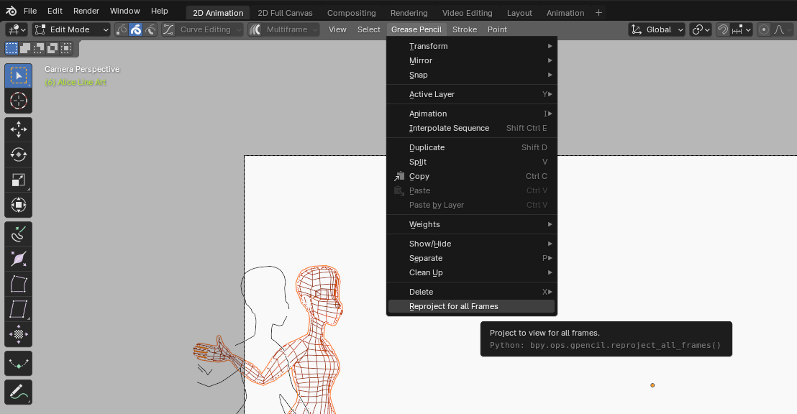
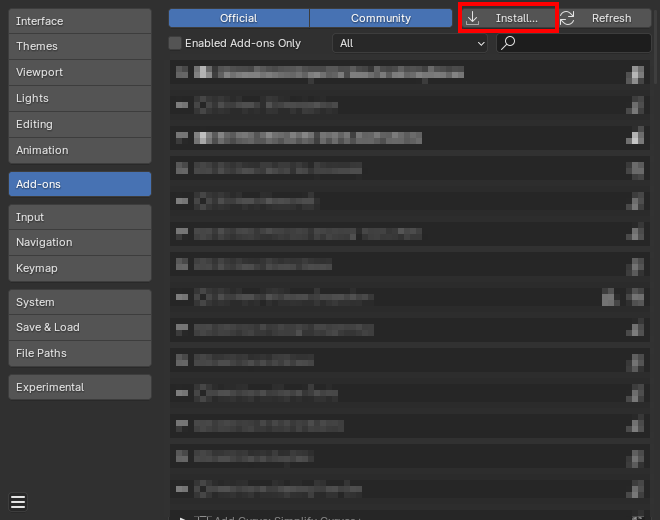

# Grease Pencil: Project to view for all keyframes

*Simple blender addon that adds an option to reproject Grease Pencil strokes for all keyframes at once
It's the equivalent of executing "Grease Pencil" -> "Cleanup" -> "Reproject Strokes" for every single keyframe.*

## Installation

1. Download <a href="https://raw.githubusercontent.com/theCalcaholic/blender_gp_reproject_all_keyframes/main/gp_reproject_all_keyframes.py" download>gp_reproject_all_keyframes.py</a>
and save it to your computer.
2. In the Blender Preferences go to Addon, then click "Install" and select the downloaded file.
3. Check the checkbox to enable the plugin "GreasePencil: Project to View for all Keyframes"

    